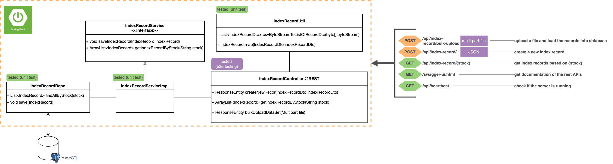
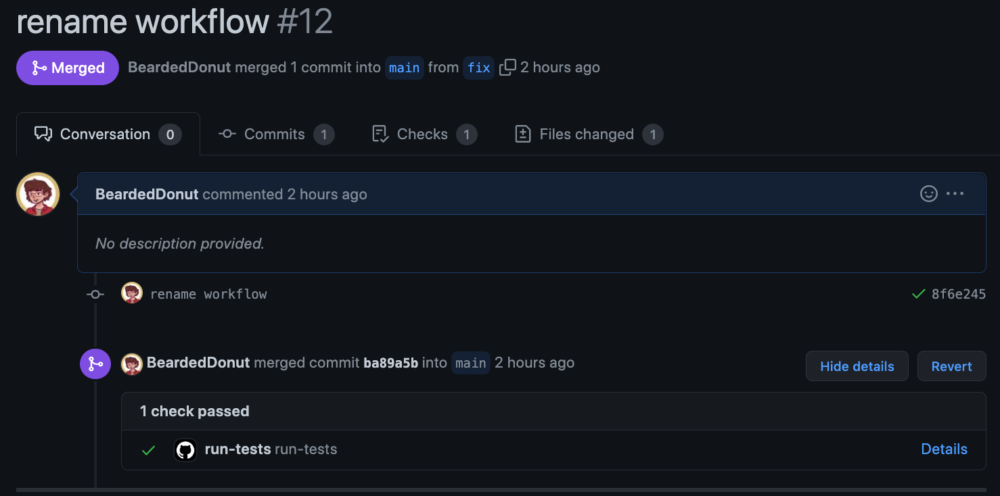
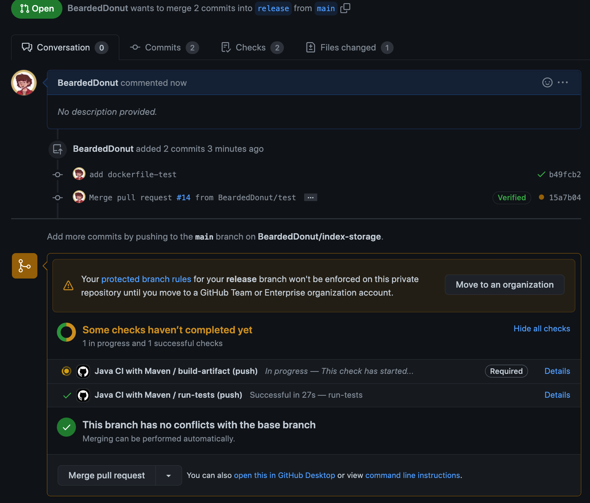

# index-storage
As a programmer with a fascination for stock markets, you got excited about a new data set that you discovered

that there is a collection of records from the [Dow Jones Index from 2011](http://archive.ics.uci.edu/ml/datasets/Dow+Jones+Index#) that caught your attention.

 
You decided you'd like to build an application server (Spring Boot or NodeJS) that would allow multiple users to perform the following operations concurrently:

- upload a bulk data set
- query for data by stock ticker (e.g. input: AA, would return 12 elements if the only data uploaded were the single data set above)
- add a new record

# Proposed Solution
## Overview:


I decided to use Spring Boot for implementing the solution and wanted to also automate the testing and building process. 
The application is broken down into a 3 tiers 
- Controllers: Handle the HTTP requests and call the services accordngly with correct parameters to satisfy the request.
    - `IndexRecordController` is responsible to handle the HTTP requests coming to the `/api/index-record`. It should be able to handle requests for:
        - bulk file upload to the database
        - getting index record from database based on the Stock (e.g. "AA")
        - create a new index record given
    - `HeartBeatController` is responsible to send HTTP.OK (200) whenver a GET
    request has arrived at `/api/heartbeat`
- Services: Handle the business logic and functionalities
    - `IndexRecordService` is reponsible to 
        - **SAVE** an index record object
        - **Retrieve**  index record objects based on a given given Stock (e.g. "AA")
- Repos: Should communicate with database to query and fetch the object from the database
    - `IndexRecordRepo` is responsible for
        - querying the database to fetch index record objects based on a given Stock
        - save an index record to the database

Apart from above-mentioned components there are 3 others that should be noted:
- DTOs: Data Transfer Objects are used as a container object to carry raw information from the outside of application and into the Controllers. The DTOs should be mapped later to a Model inside the application.
    - `IndexRecordDto`: is a DTO for `IndexRecord`
- Models: The model object inside the application and can be stored to the database.
    - `IndexRecord`: is a model of and index record 
- Utils: Some utility functions such as mappers that convert DTOs to Models and the other way. 
    - `IndexRecordUtil` is responsible for: 
        - mapping `IndexRecordDto` to `IndexRecord`
        - creating a list of `IndexRecordDto` from a byte stream

## APIs
Note: REST APIs are available on `/swagger-ui.html` when you deploy the application.

Note: you can also see the published API's [here](https://documenter.getpostman.com/view/3505676/UzJPLEf9). 

| Url                             | HTTP Method | Content Type    | Response                                                                                     |
|---------------------------------|-------------|-----------------|----------------------------------------------------------------------------------------------|
| `/api/index-record`            |     POST    |       json      | 200 OK (valid request)                                                                       |
| `/api/index-record/bulk-upload` |     POST    | multi-part-file | 200 OK (valid)<br>400 BAD REQUEST (no record to upload)                                      |
| `/api/index-record/{stock}`     |     GET     |        -        | 200 OK (valid request)<br>404 NOT FOUND (no record found)<br>400 BAD REQUEST (invalid stock) |
| `/api/heartbeat`                |     GET     |        -        | 200 OK                                                                                       |
| `/swagger-ui.html`              |     GET     |        -        | 200 OK                                                                                       |

## How to test?
There are already a run-test github voter which runs the test whenever there is a new pull request on `main` branch. 

However, if you still want to manually run the tests you can follow the steps below (you need docker):
1. Clone the repository
```bash
git clone git@github.com:BeardedDonut/index-storage.git
```
2. Build a docker image `Dockerfile-test`
```bash
docker image build -f Dockerfile-test .
```
3. You can see the TEST phase of the maven when the image is building and if there are failure the image build won't finish successfully. 
4. [Optional] if you still want to run the tests directly, you con run the following command (you should have mvn installed and setup)
```bash
mvn -f pom.xml test -P test
```

## How to build?
There is also a build action in Github which checks whether the application builds successfully or not and is triggered only on pull requests on `release**` branches.

If you want to build the project and create a deployable docker image you can follow these steps:
1. Clone the repository
```bash
git clone git@github.com:BeardedDonut/index-storage.git
```

2. change the pom.xml according to your settings
```xml
<profile>
            <id>dev</id>
            <properties>
                <activatedProperties>dev</activatedProperties>
                <db.url>jdbc:postgresql://database:5432/indexDB</db.url>
                <db.pass>navid1234</db.pass>
                <db.user>root</db.user>
                <db.dialect>org.hibernate.dialect.PostgreSQLDialect</db.dialect>
                <db.driver>org.postgresql.Driver</db.driver>
            </properties>
        </profile>
```

3. Build a docker image `Dockerfile-test`
```bash
docker image build --tag=index-storage . 
```
4. use the image to deploy (NOTE: the build will fail if the database is not setup correctly)

## How to deploy?
I wanted to make it easy for deploying the application so I created a docker-compose which creates and deploys both the database and the application together. You can follow these steps:
1. [Optional] If you want to deploy on a remote server, SSH into it and make sure docker is installed and running, then create a docker-swarm.
```
docker swarm init
```

2. Clone the repository
```bash
git clone git@github.com:BeardedDonut/index-storage.git
```

3. Run docker-compose file
```
docker-compose up --build
```
once the build finished you can go to 
- http://localhost:8080/api/index-record/ To use the APIs
- [Note]: if you're on a remote server, replace the `localhost` with the server url or ip and make sure that port 8080 is expored.


# What's next? and how to improve?
Here are a list of things that I believe can improve the performance and maintainability of this application:

- **Performance Improvements**:
    - Async dataset upload: 
        currently, whenever a data set file is uploaded to the
        server, user should wait for the server to process the file and load the data records into the database. 
    
        Instead of this, we can leverage `@EnableAsync` and `@Async` to create an upload Task object that contains and Id and Status `({Processing, Finished, Error})` then pass the file to an external method with `@Async` annotations and return the task to the user. 

        In the background the process processes the file and then updates the status of the task.

        We also need to persist the task objects into the database and also provide a REST controller for users so that they can find out about status of the task by providing the task id.

    - Transient Attributes [Maybe?]: 
        I was wondering if any of the attirbutes of the model such as `percent_change_next_weeks_price` can be calculated from other attributes? In that case we can mark them as `@Transient` and reduce the loading and saving time. However, I am not an expert and this change requires some domain knowledge.

- **Maintenance**:
    - Add more tests:
        - Currently I have only unit test for 3 components and 8 unit tests in total so adding more tests can be quite good.

**More**:
- push to dockerhub from github actions


